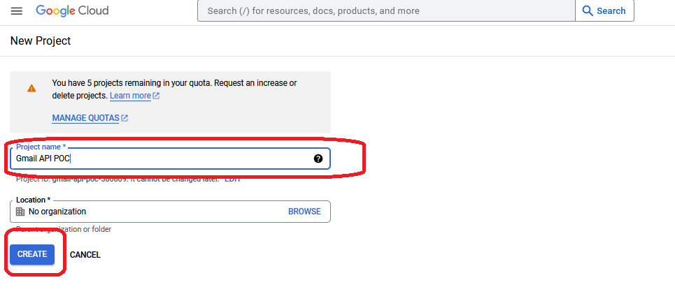
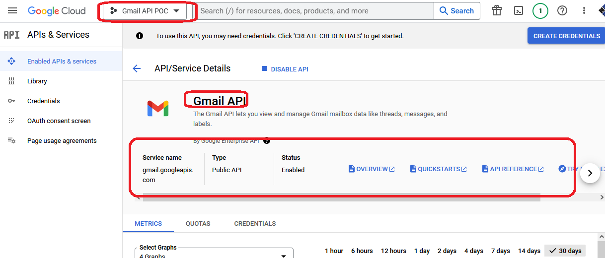

<h2>Motivation</h2>
POC for gmail api send using node server

<h2>Design</h2>
<ul>
<li>use googleapis package</li>
<li>use service account</li>
</ul>

<h2>Setup</h2>
<ol>
<li>Navigate to <a href='https://console.cloud.google.com/workspace-api'>google cloud console</a> and create a google cloud project to use Google Workspace APIs with google project name "Gmail API POC"

<ol>
<li>create google cloud project

</li>

<li>insert google cloud project name and create

</li>

<li>google cloud project created

</li>
</ol>

</li>
<li>Enable gmail API for "Gmail API POC" project
<ol>
<li>click workspace and choose project

</li>

<li>click APIs button

 

</li>

<li>Choose gmail API

 

</li>

<li>click Enable API

</li>

<li>Gmail API is enabled

</li>

</ol>
</li>
<li>Create credential - service account

<ol>
<li>Navigate to the cerdential screen

</li>

<li>click on manage service account

</li>

<li>click on create service account

</li>

<li>service account fill template

</li>

<li>service account filled

</li>

<li>service acccount created click manage keys

</li>

<li>service acccount create keys

</li>

<li>service acccount create keys json file

</li>

<li>service acccount keys created

</li>

</ol>

</li>
<li>Export the service credential file , but git ignored</li>
<li>Grant the service account access to the workspace domain (this remind Share the resource - google sheet file with client_email done <a href='https://github.com/NathanKr/google-sheets-api-playground'>here</a> )</li>
<li>Use the credential file (must be on .gitignore) inside your application which uses gmail api</li>
</ol>

<h2>Reference</h2>
<ul>
<li>the code in index.js is from here<a href='https://github.com/googleapis/google-api-nodejs-client/blob/main/samples/gmail/send.js'>here</a>
</li>
<li>this sample is about gmail api but not using send <a href='https://developers.google.com/gmail/api/quickstart/nodejs'>here</a>however, both googleapis and @google-cloud/local-auth are used</li>
</ul>

<h2>Points of interest</h2>
<ul>
<li>The <a href='https://www.npmjs.com/package/@google-cloud/local-auth'>docs of @google-cloud/local-auth package</a> (40K weekly doanlaods) say that this package should be used as starter project and is not general purpose solution. He suggest to explore other options in <a href='https://github.com/googleapis/google-auth-library-nodejs'> authentication library for Node - googleapis/google-auth-library-nodejs</a> (7M week downloads)</li>
<li>when you look into the code of @google-cloud/local-auth package <a href='https://www.npmjs.com/package/@google-cloud/local-auth?activeTab=explore'>here</a> you can see that it uses google-auth-library (7M week downloads). thus it is a simple wrapper which make it easy to use</li>
</ul>